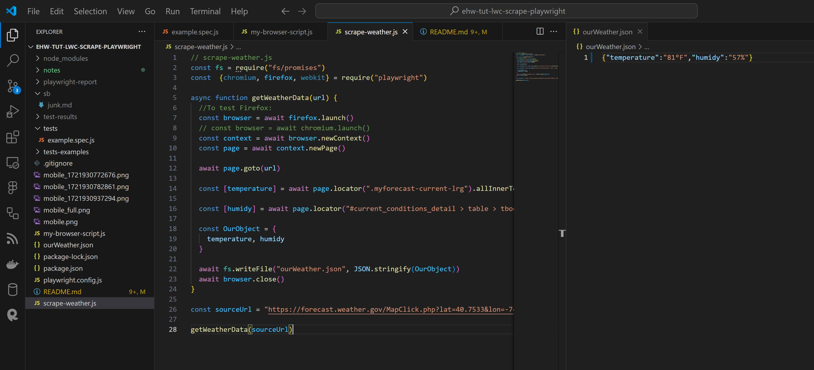

| INFO PROPERTY | VALUE                                          |
| ------------- | ---------------------------------------------- |
| Program Name  | **APP: Screenshot Website** |
| File Name     | README.md                                      |
| Date Created  | 08/06/24                                       |
| Date Modified | --                                             |
| Version       | 00.01.00                                       |
| Programmer    | **Eric Hepperle**                              |

### GITHUB REPO

- https://github.com/codewizard13/ehw-app-screenshot-website

### TECHNOLOGIES


<br><br>

**VSCODE: scrape-weather.js, ourWeather.json**:




## TAGS

`JavaScript` `Async-Await` `Playwright` `Coding` `Scraping`


## PURPOSE

Screenshot each page of a website remotely/automatically using PlayWright and node.js.

## PLUGINS & DEPENDENCIES

- **Playwright**: enables reliable end-to-end testing for modern web apps
- **NodeJS**: Node.js lets developers use JavaScript to write command line tools and for server-side scripting

## USAGE

- Type `node` then the name of the script:

```js
node scrape-weather.js

node my-browser-script.js
```

## NOTES

Notes are located in [./notes/main.md](./notes/main.md)

## RESOURCES & REFERENCE

- https://www.youtube.com/watch?v=tLU4GZHZBYk&t=14s&ab_channel=LearnWebCode
- https://www.simonsmith.io/destructuring-objects-as-function-parameters-in-es6
- https://mariusschulz.com/blog/typing-destructured-object-parameters-in-typescript
- https://chatgpt.com/c/5e133a65-6dc8-4465-85ee-51f77726bc64